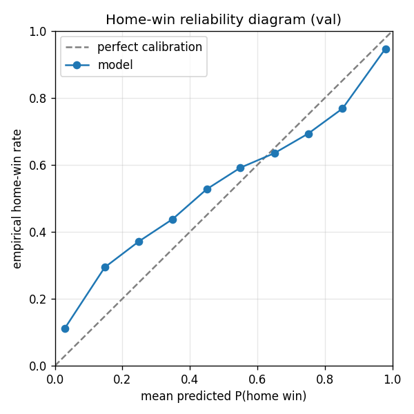

# DiamondAI — MLB pitch-sequence transformer

An autoregressive, decoder-only Transformer (JAX + Flax) that reads a baseball game one pitch at a time and predicts the next pitch, the eventual at-bat outcome, and a running home-team win probability. Trained on a decade of pitch-level Statcast data on a Kaggle TPU, with a hand-written FlashAttention-style Pallas kernel as the systems-ML component.

## What it is, and what it is not

The goal is to **model the conditional dynamics of a baseball game** — given the sequence of pitches and the surrounding context (count, base state, matchup, score), what happens next — and to do it well enough to be calibrated and clearly better than naive baselines. The four prediction heads are framed as a way to probe what the model has learned about pitch selection, plate-appearance results, and game state.

This is explicitly **not** an attempt to beat betting markets. Sportsbook win probabilities incorporate injuries, lineups, weather, line movement, and money flow that this model never sees. The win-probability head is included because it is a clean calibration target and a natural game-state readout, not because it is competitive with a market price. Numbers below are honest held-out metrics against simple baselines, not edge claims.

## Architecture overview

- Decoder-only causal Transformer, **~7.5M parameters**: `d_model = 256`, **6 layers**, **8 attention heads**, feed-forward expansion `mlp_ratio = 4`, `max_len = 256`, dropout **0.3**.
- **Per-position input embedding** is the sum of one learned table per categorical field (15 fields, including learned pitcher/batter embeddings) plus a learned positional embedding. PAD id 0 is embedded like any value and contributes nothing because attention masks it out and the losses mask pad positions — padding is distinguished *structurally* by masks, never by value (id 0 is also a legitimate category, e.g. FOUR_SEAM / BALL).
- Pre-LayerNorm decoder blocks (causal multi-head attention → residual; GELU MLP → residual), then a final LayerNorm.
- **Four linear heads** off the final hidden states (multi-task):

| Head | Classes | Target |
| --- | --- | --- |
| `next_pitch_type` | 7 | next pitch's type bucket |
| `next_pitch_outcome` | 6 | next pitch's result (ball/strike/foul/in-play/HBP) |
| `ab_outcome` | 9 | eventual outcome of the current plate appearance |
| `home_win` | 2 | whether the home team wins (per-pitch win probability) |

Masked multi-task loss: `target_mask` (valid, non-final, non-pad positions) for the two next-pitch heads; `attention_mask` (every real pitch) for `ab_outcome` and `home_win`. Each head normalizes by its own mask sum. Loss weights **1.0 / 1.0 / 0.5 / 0.1** (`next_pitch_type` / `next_pitch_outcome` / `ab_outcome` / `home_win`).

Model code: [src/model/transformer.py](src/model/transformer.py), config [src/model/config.py](src/model/config.py); loss [src/train/loss.py](src/train/loss.py).

## Data pipeline

- **Source:** MLB Statcast pitch-level data via `pybaseball`, seasons **2015–2024** (10 seasons) — roughly **7.0M pitches** across **24,077 games**. Pulled once locally and cached to parquet; the pull is idempotent and retries with backoff so it is never re-run when a cache exists ([src/data/pull.py](src/data/pull.py)).
- **Tokenizer** ([src/data/tokenize.py](src/data/tokenize.py)) sorts each game into true chronological order, maps raw Statcast fields onto a **frozen vocabulary** ([src/data/vocab.py](src/data/vocab.py)), and emits one list-typed row per game to `data/tokenized/sequences.parquet`, plus `vocab.json` and `players.json`. The vocabulary is locked: bucket orders and ids cannot change once data is tokenized without invalidating every cached sequence and checkpoint. Pitch-timer pseudo-pitches (no pitch thrown) are dropped before encoding; schema drift in pitch descriptions raises rather than silently bucketing.
- **Split:** deterministic **95 / 5** train/val by hashing `game_pk` (`md5(game_pk) % 100 < 5`), giving **22,852 train / 1,225 val** games. The same `split_games` function is reused at eval time so the held-out set is exactly the games training never saw.

The tokenized corpus is uploaded as a Kaggle dataset; the model trains there.

## Tokenization scheme

Each pitch becomes a token built from these fields (sizes are the frozen embedding-table sizes):

| Field | Size | Meaning |
| --- | --- | --- |
| `pitch_type` | 7 | FOUR_SEAM, SINKER, CUTTER, SLIDER, CURVE, OFFSPEED, OTHER |
| `pitch_outcome` | 6 | BALL, CALLED_STRIKE, SWINGING_STRIKE, FOUL, IN_PLAY, HBP |
| `zone` | 14 | 13 Statcast strike-zone / edge zones + UNKNOWN |
| `ab_outcome` | 9 | K, BB, HBP, SINGLE, DOUBLE, TRIPLE, HR, OUT, OTHER |
| `balls` / `strikes` | 4 / 3 | count, clipped 0–3 / 0–2 |
| `outs` | 3 | 0–2 |
| `base_state` | 8 | 3-bit runner occupancy (1B / 2B / 3B) |
| `inning` | 11 | 1–10 (extras clipped); 0 reserved for pad |
| `inning_topbot` | 2 | top / bottom |
| `score_diff` | 21 | batting − fielding score, clipped [−10, +10] |
| `stand` / `p_throws` | 2 / 2 | batter / pitcher handedness (L / R) |
| `pitch_num_in_pa` | 16 | pitch number within the PA, 1–15 (clipped); 0 pad |
| `pitcher_idx` / `batter_idx` | 6,209 each | learned per-player embeddings — **6,208 players**, index **0 = UNKNOWN** for unseen/live players |

These are summed into a single `d_model` vector per position, plus the positional embedding. The categorical sizes come straight from `data/tokenized/vocab.json`, which `ModelConfig` reads at construction so the model can never silently drift from the tokenizer.

## Training

Full training runs on a **Kaggle TPU v5e-8** (free tier), data-parallel across the 8 TPU cores via `jax.shard_map`: the batch is sharded over a `('data',)` mesh, params are replicated, and per-shard gradients are averaged with `lax.pmean`. The same step runs unchanged on 1 device (local CPU wiring check) or 8. Optimizer is AdamW with a warmup + cosine-decay schedule (base LR **3e-4**), weight decay **0.01**, global-norm gradient clipping at **1.0**. Checkpointing is Orbax (best-by-val-loss and last); early stopping uses patience **5** on validation loss. Training entry point: [notebooks/train_kaggle.py](notebooks/train_kaggle.py); loop and sharding in [src/train/train.py](src/train/train.py).

### The overfit, and the fix

The first serious run trained on **3 seasons (~10.5k games)** with dropout **0.1** and a `home_win` loss weight of **0.3**. It overfit badly: validation loss **diverged from ~3.39 up to ~5.0** while training loss kept falling. The diagnosis was twofold — too little data for the model capacity, and an over-weighted win-probability head that is easy to memorize (the game's final result is constant across all its pitches, so a high-capacity model can latch onto per-game shortcuts).

The fix changed three things at once and is the reason the model generalizes:

1. **3× the data** — expanded from 3 to 10 seasons (**~24k games**).
2. **Stronger regularization** — dropout **0.1 → 0.3**.
3. **Down-weighted the memorization-prone head** — `home_win` weight **0.3 → 0.1**, plus early stopping (patience 5).

The corrected run held validation loss flat with training (no divergence) and auto-stopped at the validation minimum: **best step 6000, val loss 3.247**. That checkpoint produced every number below.

## Results

Held-out metrics on the **1,225 validation games**, model vs. a most-frequent-class baseline per head (from [eval_out/summary.md](eval_out/summary.md); reproduced by [src/eval/evaluate.py](src/eval/evaluate.py)). Accuracy is top-1; log-loss is pooled cross-entropy over the masked positions.

| Head | Model top-1 | Baseline | Model log-loss | Baseline log-loss |
| --- | --- | --- | --- | --- |
| `next_pitch_type` | 50.6% | 33.6% | 1.1379 | 1.7184 |
| `next_pitch_outcome` | 37.3% | 35.4% | 1.4555 | 1.5488 |
| `ab_outcome` | 53.3% | 40.1% | 1.2122 | 1.5280 |
| `home_win` | 77.7% | 52.0% | 0.4792 | 0.6931 |

For `home_win`, the baseline is majority-class accuracy and a constant-0.5 log-loss. Win-probability calibration is the more meaningful signal: **Expected Calibration Error 0.072** over 10 bins.



*Reliability diagram ([eval_out/calibration.png](eval_out/calibration.png)): mean predicted P(home win) vs. empirical home-win rate per bin, against the y = x line. Per-bin counts and an ECE breakdown are in [eval_out/calibration.csv](eval_out/calibration.csv) and [eval_out/metrics.json](eval_out/metrics.json).*

### What the model learned

- **Next-pitch type (50.6% vs 33.6%, +17 pts)** is the clearest signal. A conditional baseline that predicts the most common pitch type *given the ball–strike count* lands at the same **33.6%** — a four-seam fastball is the plurality pitch in every count — so the count alone buys nothing over the marginal. The model's 17-point gain therefore comes from information *beyond* the count: the recent pitch sequence, the specific pitcher and batter embeddings, handedness, and zone/outcome history.
- **At-bat outcome (53.3% vs 40.1%, +13 pts)** shows the model reading plate-appearance state, not just the base rate of outs.
- **Next-pitch outcome (37.3% vs 35.4%, +1.9 pts)** is intentionally modest. Whether the next pitch is a ball, strike, or foul is close to irreducible pitch-to-pitch, and the small edge over the marginal is roughly what is realistically available here.
- **Home win (ECE 0.072)** is well-calibrated. The headline 77.7% accuracy is flattering and should be read with care — it is computed per pitch over the whole game, so late-game positions where the result is nearly settled inflate it. Calibration across the probability range is the honest measure, and the reliability curve tracks the diagonal.

## Custom TPU kernel (Pallas)

A hand-written **FlashAttention-style fused attention kernel in Pallas** ([src/model/attention_pallas.py](src/model/attention_pallas.py)), the systems-ML centerpiece. It tiles queries over a `(batch, head, q_block)` grid and streams key/value blocks with an **online softmax** (running max and sum, fp32 statistics), so the full `[T, T]` score matrix is never materialized. Causal block-skipping bounds the key loop to blocks that can contain an allowed key. Causal masking is computed in-kernel from block indices; **key-padding is folded in as a per-key additive bias** shaped `[B, 1, T]` — passed un-blocked along the sequence so its block shape satisfies Mosaic's `(8, 128)` TPU tiling rule, since a blocked per-row mask does not lower on TPU.

**Correctness** is checked against a plain-JAX reference ([src/model/attention_ref.py](src/model/attention_ref.py)) across **16 shapes** (fp32 / bf16, with and without masks) in [tests/test_attention.py](tests/test_attention.py), run in Pallas CPU-interpret mode.

**Performance**, autotuned block sizes, benchmarked against XLA's compiled attention on TPU v5e-8 at **B = 4, H = 8, D = 64** ([notebooks/bench_attention.py](notebooks/bench_attention.py)):

| Sequence length T | Speedup vs XLA |
| --- | --- |
| ≤ 512 | XLA wins or ties |
| 1024 | 1.54× |
| 2048 | 2.34× |
| 4096 | 3.32× |

**Honest regime analysis.** The kernel wins only where FlashAttention is supposed to win — realistic batch/head counts and long context — and the advantage grows with sequence length. At short lengths (≤ 512) XLA's own attention fusion already wins or ties, so there is no point replacing it there. `T = 8192` hit a Mosaic 128-alignment edge with sub-128 tiles and was left out of the reported table rather than worked around or estimated.

Two caveats stated plainly: the kernel is a **standalone artifact — it is not wired into `transformer.py` or the training path**, which uses Flax's built-in attention. And because this model's `max_len` is **256** (the regime where XLA wins), the kernel does **not** accelerate this model's training; it is a forward-looking systems exercise for the long-context regime, validated for correctness and benchmarked honestly.

## Repository layout

```
src/
  data/    pull.py (Statcast → parquet), tokenize.py (sequences), vocab.py (frozen vocab), dataset.py (numpy loader/batcher)
  model/   transformer.py (decoder-only LM + 4 heads), config.py (vocab-derived config),
           attention_pallas.py (Pallas fused kernel), attention_ref.py (plain-JAX oracle)
  train/   train.py (shard_map data-parallel loop, Orbax ckpt, early stop), loss.py (masked multi-task loss)
  eval/    evaluate.py (held-out metrics + baselines + calibration), report.py (scoring/plot/artifacts)
notebooks/ train_kaggle.py (TPU training), bench_attention.py (kernel autotune + benchmark)
tests/     test_attention.py (kernel correctness vs reference)
eval_out/  metrics.json, summary.md, calibration.png, calibration.csv (generated)
data/      cached Statcast parquet + data/tokenized/ (gitignored)
```

## Reproducing

```bash
pip install -r requirements.txt

# 1. Pull Statcast → data/statcast_<year>.parquet (slow, rate-limited, cached; run once)
python -m src.data.pull

# 2. Tokenize → data/tokenized/{sequences.parquet, vocab.json, players.json}
python -m src.data.tokenize

# 3. Local wiring gate before any TPU run: overfit a tiny slice (combined loss < 0.1)
python -m src.train.train --overfit

# 4. Train on Kaggle TPU: upload data/tokenized/ as a Kaggle dataset, run notebooks/train_kaggle.py
#    on a TPU v5e-8 instance (writes Orbax best/ + last/ checkpoints)

# 5. Evaluate a restored checkpoint → eval_out/ (runs on CPU; inference only)
python -m src.eval.evaluate --ckpt <path-to-best-step-dir>

# Kernel: correctness (CPU interpret) and benchmark (TPU)
pytest tests/test_attention.py
python notebooks/bench_attention.py
```

The evaluator restores the TPU-saved (8-device replicated) checkpoint onto whatever device is present — it forces a single-device replicated sharding — so eval runs on a 1-core CPU without the saved 8-device topology.

## Limitations and caveats

- **The 95/5 split is by game hash, not by time.** Train and validation share seasons, so the metrics measure generalization across *games*, not strictly forward-in-time forecasting; a temporal holdout would be a harder and more realistic test.
- **Win-probability accuracy is per-pitch and inflated by late-game positions.** Use ECE / the reliability curve, not the 77.7% headline, to judge the win head.
- **Player cold-start:** unseen or live players map to the UNKNOWN embedding (id 0), so rookies and current-day players get a generic representation until retrained.
- **One reported run.** Results come from a single training run and checkpoint (best step 6000); no seed averaging, ensembling, or full hyperparameter sweep beyond the documented overfit→fix change.
- **The Pallas kernel is not in the training path** and does not speed up this model at `max_len = 256` (see the kernel section).
- **Eval was run on CPU** (inference only); the device used is recorded in `eval_out/metrics.json`.
- **Live serving is not built yet** — see below.

## Planned / in progress

A live-serving demo against real games is intended but not implemented in this repository. The plan is a FastAPI endpoint plus a poller for the MLB Stats API GUMBO feed (wrapped in a thin adapter so a feed change is a one-file fix, polled ≥ 5s with caching and backoff), feeding a small React/Vite front-end. None of that code exists yet; nothing here should be read as a working live service.

## Tech stack

Python 3.12 · JAX + Flax · Optax · Orbax · Pallas (TPU kernel) · `pybaseball` (Statcast) · pandas / pyarrow / NumPy · Matplotlib · pytest. Trained on Kaggle TPU v5e-8. Planned serving layer: FastAPI + MLB Stats API (GUMBO) + React/Vite.
